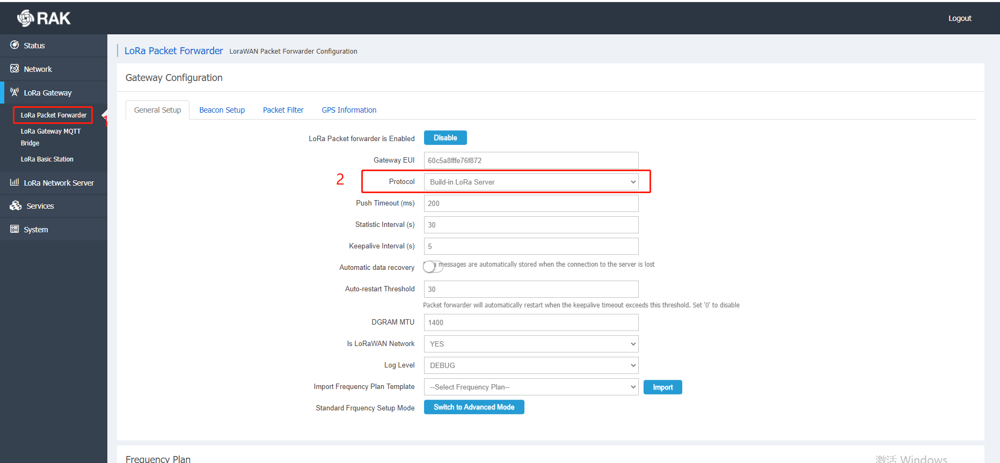

# LoRaWAN Long Packet

## Overview

This example shows how a node can send long packets that exceed the protocol limit in bytes. Only the RAK gateway support long packet sending.

## Description

In the LORA application, nodes can send not only short packets, but also long packets exceeding the LoraWAN 1.0.2 protocol byte limit. The LoRaWAN data send length and DR Specification vary from locale to locale, as shown in the LoRaWAN™1.0.2 locale parameters document. When the length of the sent data exceeds the length of the current DR Condition, the sent data should be separated.The separation adopts the commercial portal separation, and the complete data package can be viewed in cooperation with the commercial portal.To send long packet data, the commercial gateway selects the built-in LoRa Server.

and the node opens the separate send on the NS side of the commercial gateway（Enable LPTP）

This RUI limits the maximum number of bytes that can be sent, with rak811/4200/4270 sending up to 1024 bytes because the commercial gateway receives up to 1024 bytes, and RAK4600 sending up to 512 bytes because of RAM.

The example is developed on the basis of standard firmware, and the added code is in the comment range of `/* User Code */`, `/* End User Code */`. In this example, the following parameters may be used:

**1. Join Interval**

"join_interval = 10" is the automatic join cycle. If the join fails, it will automically retry. Nodes will go into sleep mode between join retries.

**2. Send Interval**

"send_interval = 20" is the time interval of sending packet automaticall. Nodes will go into sleep mode after sending a package.

**3. Port**

 "AppPort = 2" is the sending port number. Other ports 1-122 are also available.

**4. Data Buffer**

"lp_data [1024]" stands for long packet data.  
Data to be sent by the user is in LP_data. 
Data to be sent by each subcontract is put in AppData (RAK4600 should be 512). 
Data smaller than 1024 bytes can also be sent

**5. Data Length**

"lp_len = 1024" means the maximum length of the packet to be sent (RAK4600 should be 512).  
Data smaller than 1024 bytes can also be sent.

**6. Data Format/Content**

"AppData[0]++" Represents the content of the sent data, starting with "0" and ending with "FF", such as "00 01 02 03 ...... ff",total 1024 bytes.

"AppLen = 1" means each of the small units that make up the long packet is "1" ,such as "00","01","ef","ff".

Once you have configured the parameters, you need copy the "rui. h" file from the "Common Header" directory into a ".zip" format, then compile with the RAK online compilation platform and upgrade with the upgrade tool to achieve desired functionality.

**Additional Information:**

The following describes the separation protocol used in the example.

|  HDR   | MAGIC  |  FCNT  |  FSER  | FDATA_LEN |    FDATA    |  FCS   |
| :----: | :----: | :----: | :----: | :-------: | :---------: | :----: |
| 1 Byte | 1 Byte | 1 Byte | 1 Byte |  1 Byte   | 0 - N Bytes | 1 Byte |

**HDR**：Data frame header

bit0: 0 - fixed-length data packet; 1 - variable-length data packet. 
The example uses variable-length packets.

bit1: 0 - The current data packet is a normal packet; 1 - The current data packet is a retransmission packet

bit2-bit7: Reserved

**MAGIC**：Message ID. Different packets (frames) of the same message use the same message ID. (random number)

**FCNT**：Indicates the number of remaining packets (frames) estimated for the current message. When FCNT=0, it means that all packets of the current message are transmitted.

**FSER**：The sequence number of the current frame indicates which frame is the current message, and 1 is the first frame.

**FDATA_LEN**：Data length. Current frame data (FDATA) bytes.

**FDATA**：Data of the current frame.

**FCS**：Check field. 8-bit arithmetic sum of all bytes of the current frame except FCS.
