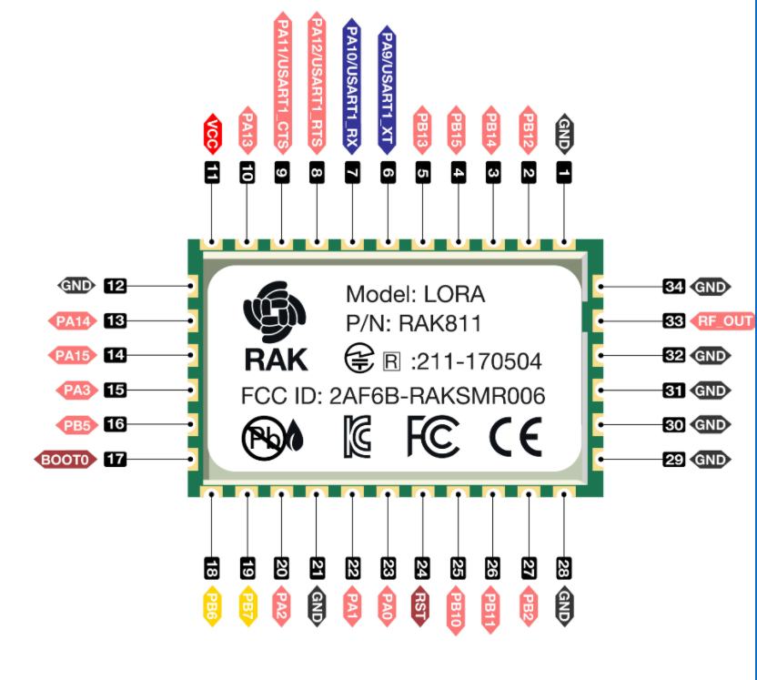

# I2C

## Overview

This example shows how RAK811 node uses the I2C interface to read and modify the time of DS3231 module.

## Description

The example is developed on the basis of standard firmware. The added code is in the comment range of `/* User Code */`, `/* End User Code */`

Important information:

1. Time reading of DS3231 mode

    There is no need to change the default code. Please refer to the example.

2. Assigning custom time

    The custom time is related to the following definition : **#define I2C_WRITE_TEST**
    
    **Note:** If the definition is commented out, custom time will not take effect

    Custom time can be set like the following examples:

    i2c_data[2] = 0x23; // Set hours 
    i2c_data[1] = 0x58; // Set minutes  
    i2c_data[0] = 0x32; // Set seconds

3. RAK811 corresponding pins: 18 (SCL), pin 19 (SDA)  
  
    Please refer to the hardware schematics:  

